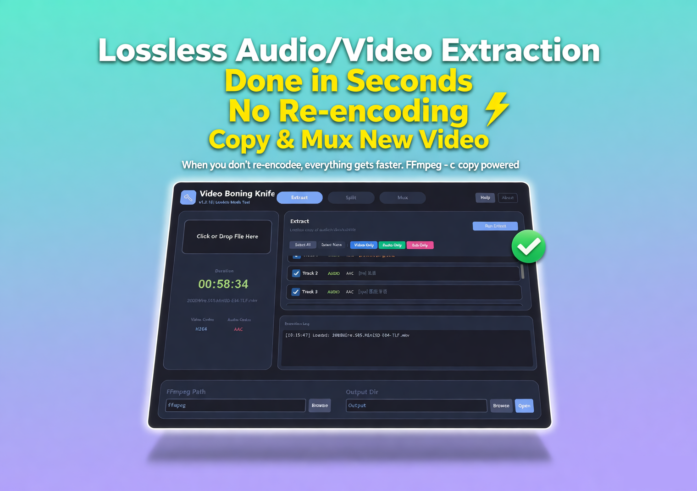
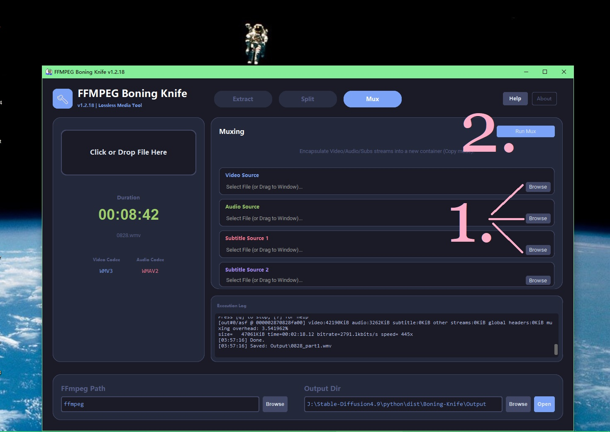
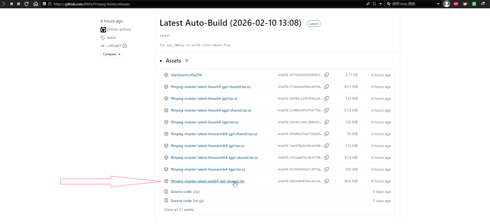
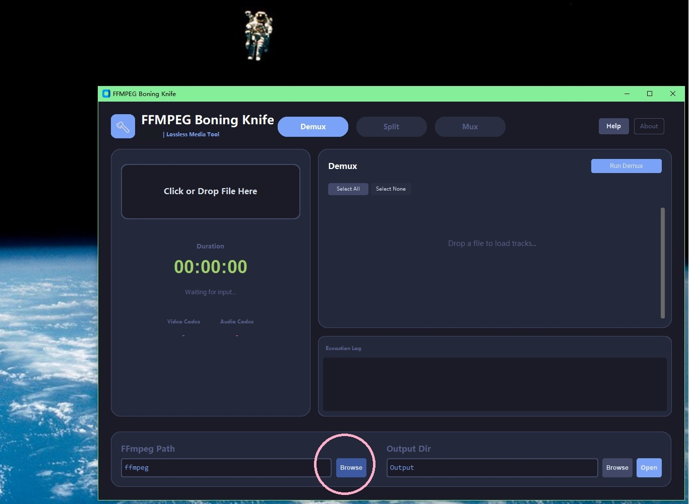
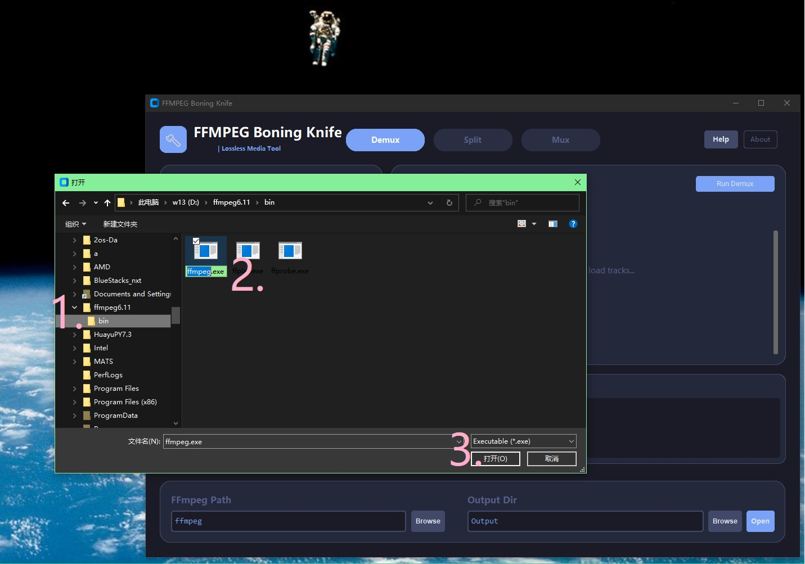

# Video-Boning-Knife

[简体中文](./README_CN.md) | **English**

Has been officially renamed: Video Boning Knife.

Direct copy mode preserves original video and audio quality at blazing speeds! A minimalist drag-and-drop GUI integrates audio, video, and subtitle streams into a single MP4/MKV file without re-encoding (powered by FFmpeg stream copying technology).

## ✨ Features
- Lossless audio and video quality at maximum speed (stream copying).
- Directly extract audio, subtitles and video. Split. combine and package.(not clip concatenation)
- The usage is extremely simple - just click the mouse 3 times.
- Automatically select the appropriate container.

## 📸 Screenshots

Import each type of track separately, and then click "mux".

## 💻 System Requirements
- 64-bit WIN10+ (Win8.1: may work but not officially supported)
- Free FFmpeg (First download from https://github.com/BtbN/FFmpeg-Builds/releases (About several dozen megabytes)
Unzip to For example, decompress to d:\ffmpeg (What Windows requires is d:\ffmpeg\bin)

## 🚀 Quick Start
1. This software will automatically search for FFMPEG in your path. If you have already added the path for FF, you can directly use it. As long as the input box is filled with "ffmpeg", Windows will automatically search for this program in the system environment variables (PATH). The input box cannot be left blank.

2. If you haven't configured the path for FF, it can help you locate the executable file: First, decompress the downloaded FF to, for example, d:\ffmpeg. In the software, click "Browse", navigate to your FF directory (for example): d:\ffmpeg\bin (the key is this bin directory). Select ffmpeg.exe and click "Open" to finish.

3. If you did not specify the output directory in advance, the software will automatically create an "output" directory in its own directory, and all the files you processed will be located there.

## 💰 Pricing
- **$7.99 ** - Lifetime license (one-time payment)
-  trial coming soon

## 📥 BUY
[https://fitzcaraldo.gumroad.com/l/hhnpu  (v1.2.18)]

[Tutorial  https://youtu.be/4ndPUh9YJ4I ]

## 📧 Support
Priority/guaranteed response for paying users; self-service FAQ and readme support first for non-paying users.
- https://github.com/91rinb18/Video-Boning-Knife/issues
- Right-click your multimedia file - mediaInfo, then select "View - Text", and copy the content therein. 
https://mediaarea.net/en/MediaInfo/Download/Windows        For example:
https://mediaarea.net/download/binary/mediainfo-gui/26.01/MediaInfo_GUI_26.01_Windows.exe

- Please copy the error log from the log area to assist in troubleshooting.
- Please provide the version number of the installed ffmpeg.

**Quick Links:** [FAQ](./FAQ.md) | [Changelog](./CHANGELOG.md)

---
© 2026 91rinb18. All rights reserved. **Commercial software - No source code included.**
