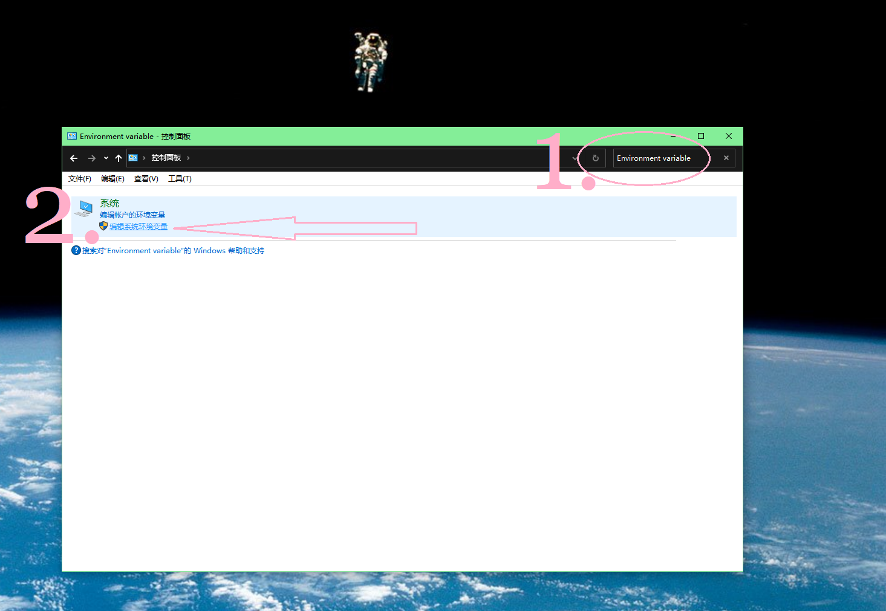

**简体中文** | [English](./README.md)

# 已正式更名：视频剔骨刀
保持原画质、音质的直接拷贝模式，速度极快！极简的拖放式图形用户界面，可将音频、视频和字幕流整合到一个单一的 MP4/MKV 文件中，无需重新编码（由 FFmpeg 流复制技术支持）

## ✨ 功能特点
- 无损音质、画质，速度最快（流复制）
- 直接提取音频字幕视频、分割、合成封装（不是拼接片段）。
- 用法极其简单，就点3下鼠标而已。
- 自动选择合适的容器

## 📸 软件截图

如果分一段，输入截止时间，然后点分割即可。分割多段就在上面点增加片段。

## 💻 系统要求
- 64位Windows 10及以上。 (Win8.1也许可以，官方已不支持)。
- 免费的FFmpeg（先从 https://github.com/BtbN/FFmpeg-Builds/releases 下载
解压缩到比如d:\ffmpeg，WINDOWS需要的是d:\ffmpeg\bin
  

## 🚀 快速开始
1. 打开控制面板，搜索Environment Variable

将 `d:\ffmpeg\bin` 加到系统 PATH

2. 启动工具 → 拖入视频/音频/字幕文件
3. 选择轨道 → 点击 **封装/导出**
4. 输出完成！

## 💰 定价
- **$9.9** - 终身授权（一次性付费）
- 试用版正在准备

## 📥 购买
[最新版本 (v1.0.0)]

## 📧 支持
  付费用户优先/保障响应；未付费用户先自助readme、FAQ支持。
- https://github.com/91rinb18/Video-Boning-Knife/issues
- 请安装免费版mediaInfo补充视频信息：右击你的文件——mediaInfo，然后“视图—文本”，复制其中内容。
https://mediaarea.net/en/MediaInfo/Download/Windows
- 请复制日志区域的报错日志，帮助排错。
- 请提供安装的ffmpeg版本号。

**快速链接：** [常见问题](./FAQ_CN.md) | [更新日志](./CHANGELOG_CN.md)
